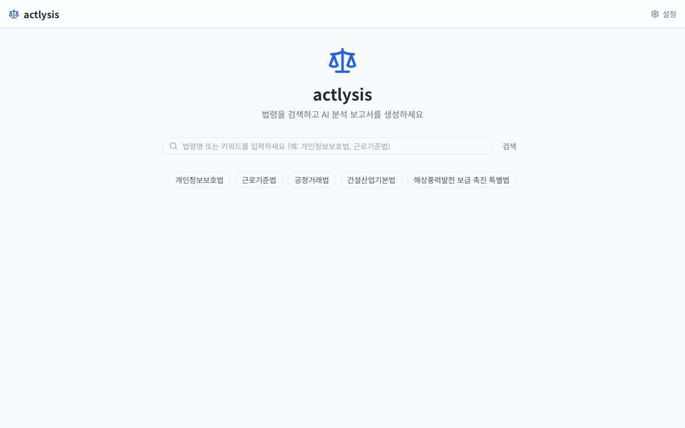
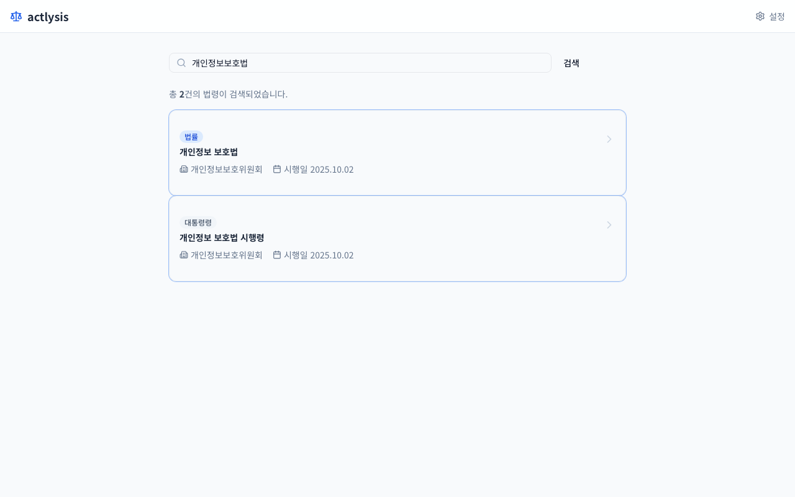
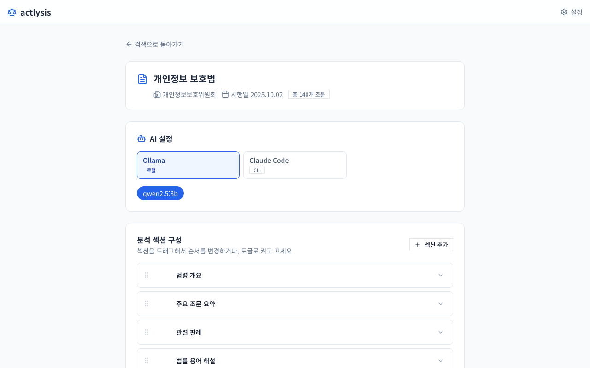
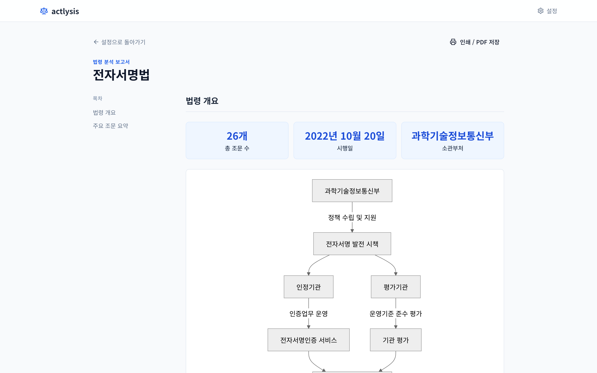
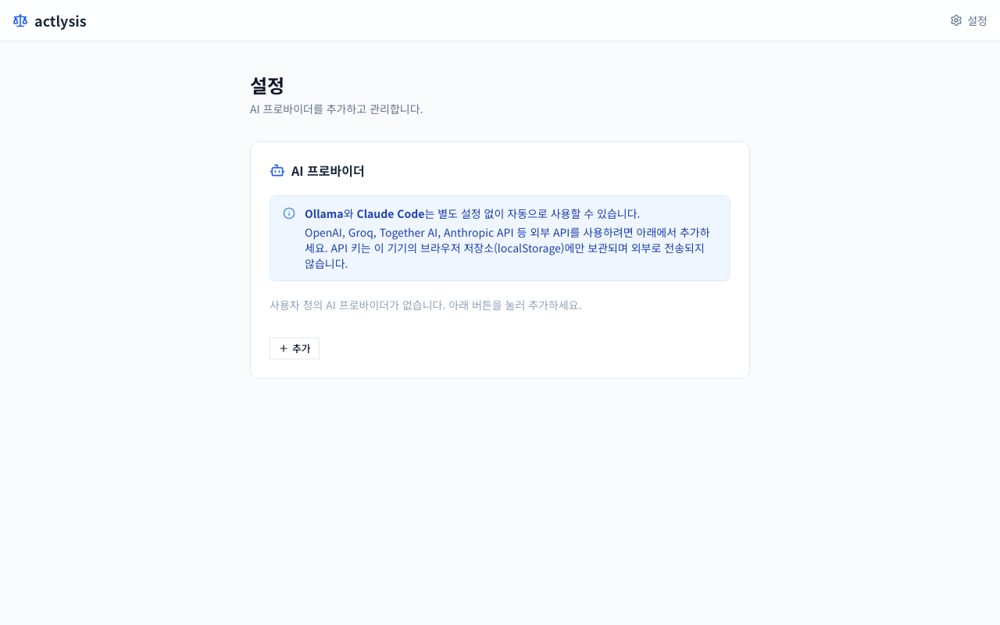
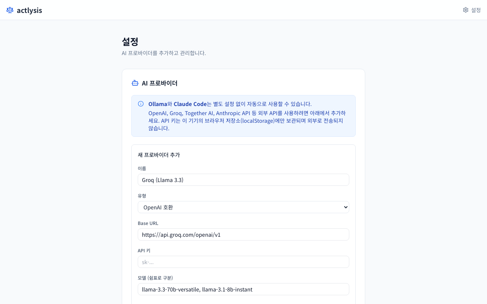

# actlysis

대한민국 법령을 검색하고 AI가 섹션별 분석 보고서를 생성하는 웹 애플리케이션입니다.

## 프로젝트 소개

actlysis는 law.go.kr Open API로 법령 원문과 관련 판례를 가져온 뒤, 로컬 AI(Ollama) 또는 외부 AI API를 이용해 구조화된 분석 보고서를 만들어 줍니다. 보고서는 **법령 개요 · 주요 조문 요약 · 관련 판례 · 법률 용어 해설** 4개 섹션으로 구성되며, 각 섹션은 마크다운 본문, 통계 카드(stats), 비교 테이블(comparison table), Mermaid 다이어그램, 타임라인, 벌칙표 등 다양한 블록으로 렌더링됩니다.

---

## 화면 구성

### 1단계 — 법령 검색

키워드를 입력하면 law.go.kr에서 법령을 검색합니다. 자주 찾는 법령은 빠른 접근 태그로 바로 이동할 수 있습니다.



### 2단계 — 검색 결과 선택

검색 결과에서 분석할 법령을 클릭합니다. 법령 유형(법률·대통령령·부령 등), 소관부처, 시행일이 표시됩니다.



### 3단계 — AI 및 섹션 설정

분석에 사용할 AI 모델을 선택하고, 원하는 섹션을 켜거나 끄고 드래그로 순서를 바꿉니다. 섹션별로 커스텀 프롬프트를 입력할 수도 있습니다.



### 4단계 — 분석 결과 보고서

분석이 완료되면 법령명, 목차(TOC), 통계 카드, Mermaid 다이어그램, 마크다운 본문 등이 구조화된 보고서로 렌더링됩니다. 아래는 Claude Code(Claude Haiku)로 **전자서명법**을 분석한 실제 결과입니다.



### 설정 — AI 프로바이더 관리

헤더의 ⚙️ **설정** 버튼을 누르면 AI 프로바이더 관리 페이지로 이동합니다. Ollama와 Claude Code는 자동 감지되며, OpenAI · Groq · Together AI · Anthropic API 등 어떤 API든 직접 추가할 수 있습니다.



프로바이더 이름, 유형(OpenAI 호환 / Anthropic API), Base URL, API 키, 모델 목록을 입력하면 분석 페이지에 즉시 나타납니다.



---

## 법제처 Open API 키 발급

actlysis는 [국가법령정보 공동활용](https://www.law.go.kr/LSO/main.do) API를 사용합니다. 무료로 발급받을 수 있으며 절차는 다음과 같습니다.

1. **회원가입** — [law.go.kr](https://www.law.go.kr) 에 접속해 우측 상단 **회원가입**을 클릭합니다.
2. **로그인 후 마이페이지** — 로그인한 뒤 우측 상단 이름 → **마이페이지**로 이동합니다.
3. **API 인증값 관리** — 마이페이지 좌측 메뉴에서 **API인증값 관리**를 선택합니다.
4. **OC 값 확인** — 화면에 표시된 **OC(Open API 인증키)** 값을 복사합니다. 이 값이 `LAW_OC_KEY` 입니다.
5. **서버 IP 등록** — 같은 화면에서 **IP 등록** 버튼을 클릭하고, API를 호출할 서버의 공인 IP를 추가합니다. 로컬에서 실행한다면 현재 PC의 공인 IP를 등록하세요.
   ```bash
   # 현재 공인 IP 확인
   curl -s -4 ifconfig.me
   ```
   > ⚠️ 카페 Wi-Fi나 VPN 등 네트워크 환경이 바뀌면 IP가 달라지므로 재등록이 필요합니다. 변경 적용까지 약 5~10분이 소요됩니다.

6. **`.env.local`에 입력**
   ```bash
   LAW_OC_KEY=발급받은_OC값
   ```

---

## 시작하기

### 사전 요구 사항

- **Node.js 18+** ([nodejs.org](https://nodejs.org))
- **law.go.kr API 키** (위 [법제처 Open API 키 발급](#법제처-open-api-키-발급) 참고)
- AI 백엔드 중 하나: **Ollama** (로컬, 권장) 또는 **Claude Code CLI**

### macOS 한 방 설치 (권장)

`setup.command` 파일을 더블클릭하면 아래를 자동으로 처리합니다.

1. Node.js 설치 여부 확인
2. npm 의존성 설치 (`npm install`)
3. law.go.kr API 키 입력 및 `.env.local` 생성
4. AI 백엔드 선택:
   - **A. Ollama** — Ollama 설치 안내 + 모델 다운로드
   - **B. Claude Code** — CLI 설치 + 로그인 터미널 자동 열기
   - **C. 둘 다**
5. 브라우저 자동 오픈 (`http://localhost:3000`)

> **Claude Code 로그인**은 Anthropic/Google 계정 인증이 필요하므로 스크립트가 터미널을 열어 안내합니다. 로그인 후 돌아와서 Enter를 누르면 앱이 실행됩니다.

### 수동 설치

```bash
git clone https://github.com/PLANiT-Institute/actlysis.git
cd actlysis
npm install
```

`.env.local` 파일을 만들고 API 키를 입력합니다.

```bash
# .env.local
LAW_OC_KEY=your_key_here
```

개발 서버를 시작합니다.

```bash
npm run dev
```

브라우저에서 `http://localhost:3000` 을 열면 됩니다.

### 이후 실행

최초 설치 후에는 `run.command`를 더블클릭하면 됩니다. Ollama가 꺼져 있으면 자동으로 시작하고, 브라우저도 자동으로 열립니다.

---

## AI 모델 설정

### A. Ollama (로컬 AI, 권장)

Ollama를 설치하고 모델을 내려받으면 API 비용 없이 로컬에서 분석이 실행됩니다.

1. [https://ollama.com](https://ollama.com) 에서 Ollama를 설치합니다.
2. Ollama 서버를 시작합니다.
   ```bash
   ollama serve
   ```
3. 원하는 모델을 내려받습니다.
   ```bash
   ollama pull qwen2.5:7b
   ```

추천 모델 목록:

| 모델 | 크기 | 특징 |
|------|------|------|
| qwen2.5:7b | ~4.7 GB | 한국어 이해도 우수, 균형잡힌 성능 |
| qwen2.5:14b | ~9 GB | 높은 정확도, 충분한 RAM 필요 |
| qwen2.5:3b | ~2 GB | 빠른 응답, 품질은 낮음 |
| llama3.1:8b | ~4.7 GB | 영어 강점, 한국어 성능 보통 |

한국어 법령 분석에는 qwen2.5 계열 모델이 더 좋은 결과를 냅니다. 앱을 열면 설치된 모델이 자동으로 감지되어 선택 가능한 pill 버튼으로 표시됩니다.

### B. Claude Code CLI

1. `install-claude-code.command` 파일을 더블클릭하거나, 터미널에서 직접 설치합니다.
   ```bash
   npm install -g @anthropic-ai/claude-code
   ```
2. 터미널에서 `claude` 를 실행하고 Anthropic 계정 또는 Google 계정으로 로그인합니다.
3. 앱에서 "Claude Code" 탭을 선택한 뒤 모델을 고릅니다.

사용 가능한 모델:

| 모델 | 용도 |
|------|------|
| Claude Opus 4 | 최고 품질, 느림 |
| Claude Sonnet 4 | 권장 — 품질과 속도의 균형 |
| Claude Haiku 4 | 빠른 응답, 간단한 분석에 적합 |

Claude Code CLI를 사용하려면 Anthropic 구독 또는 API 크레딧이 있어야 합니다.

---

## 사용 방법

1. **법령 검색** — 검색창에 키워드를 입력합니다. (예: `개인정보보호법`, `근로기준법`)
2. **법령 선택** — 검색 결과 중 분석할 법령을 클릭합니다.
3. **AI 설정** — Ollama 또는 Claude Code 탭을 선택하고 모델을 고릅니다.
4. **섹션 구성** — 분석할 섹션을 켜거나 끄고, 드래그로 순서를 바꿉니다. 섹션별로 커스텀 프롬프트를 추가할 수도 있습니다.
5. **분석 생성** — 분석 시작 버튼을 클릭합니다. 섹션들은 병렬로 분석되어 완료된 것부터 순서대로 나타납니다.
6. **보고서 확인** — 왼쪽 고정 목차(TOC)로 섹션 간 이동하고, 완료 후 인쇄/저장 버튼을 사용합니다.

---

## 환경 변수

| 변수 | 필수 | 설명 |
|------|:----:|------|
| `LAW_OC_KEY` | ✅ | law.go.kr Open API 인증키 |
| `OLLAMA_BASE_URL` | ❌ | Ollama 서버 주소 (기본값: `http://localhost:11434`) |
| `CLAUDE_BIN` | ❌ | `claude` CLI 실행 경로 (기본값: `claude`) |

---

## 문제 해결

### 검색 결과가 없거나 502 오류가 발생합니다

law.go.kr은 IP 기반 접근 제어를 사용합니다. [마이페이지 → API인증값](https://www.law.go.kr) 에서 현재 사용 중인 IP를 등록했는지 확인하세요. 네트워크 환경이 바뀌면 (카페 Wi-Fi, VPN 등) IP가 변경되므로 재등록이 필요합니다.

### Ollama 모델 목록이 비어있습니다

`ollama serve` 가 실행 중인지 확인합니다. 별도 터미널에서 `ollama list` 를 실행해 설치된 모델 목록을 확인하세요. 모델이 없다면 `ollama pull qwen2.5:7b` 로 하나를 내려받습니다.

### 분석이 너무 느립니다

더 작은 모델(3b 또는 7b)로 바꾸거나, Claude Code로 전환해 보세요. 14b 이상 모델은 RAM 16 GB 이상을 권장합니다.

### Claude 로그인 오류가 납니다

터미널에서 `claude` 를 직접 실행해 로그인 상태를 확인하고 필요하면 재로그인합니다.

---

## 기술 스택

- Next.js 14 (App Router)
- TypeScript
- Tailwind CSS
- shadcn/ui
- law.go.kr Open API
- Ollama
- Claude Code CLI (`@anthropic-ai/claude-code`)
- Mermaid.js
- @hello-pangea/dnd
